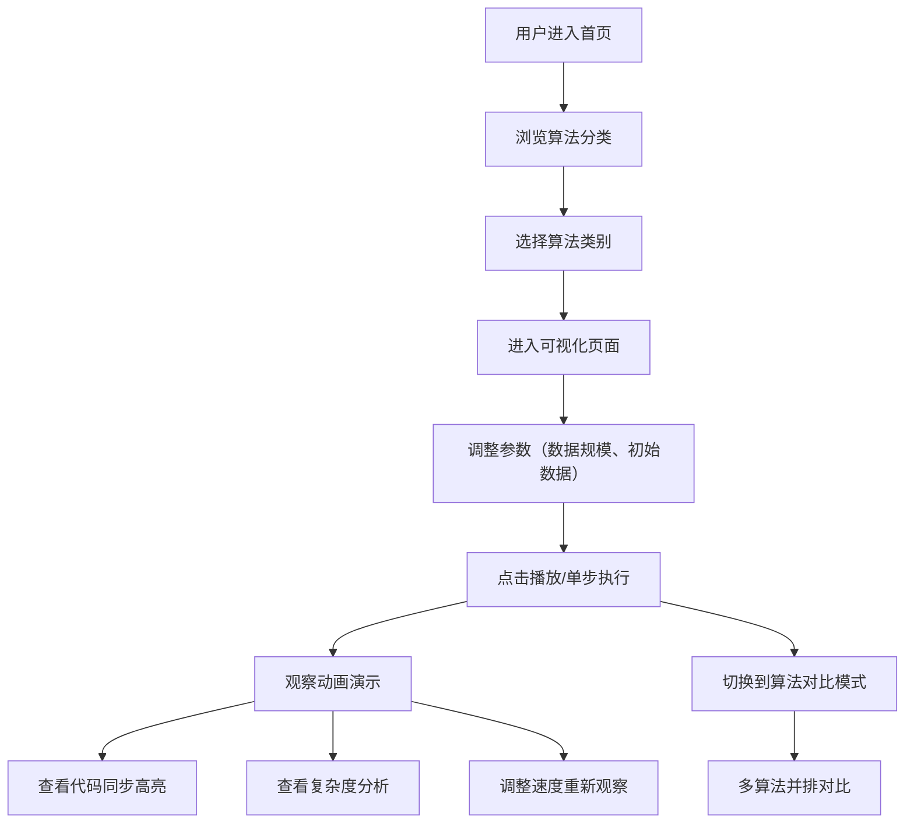

# 算法可视化教学工具 - 产品需求文档

## 1. 产品概述

面向计算机科学教学场景的算法可视化Web应用，支持20+经典算法的动态执行演示，覆盖排序、图论、动态规划三大核心类别。通过直观的动画演示和丰富的交互功能，降低算法学习门槛，提升教学效率。

- **目标用户**：高校学生、算法初学者、计算机教师
- **核心价值**：将抽象的算法逻辑转化为可视化的动态过程，让学习更直观高效

## 2. 核心功能

### 2.1 功能模块

1. **首页**：算法分类导航、精选算法推荐、项目介绍
2. **排序算法可视化**：冒泡排序、选择排序、插入排序、快速排序、归并排序、堆排序、希尔排序、计数排序
3. **图论算法可视化**：广度优先搜索(BFS)、深度优先搜索(DFS)、Dijkstra最短路径、Prim最小生成树、Kruskal最小生成树、Floyd最短路径、拓扑排序
4. **动态规划可视化**：斐波那契数列、0-1背包问题、最长公共子序列(LCS)、最长递增子序列(LIS)、爬楼梯问题、硬币找零
5. **控制面板**：播放/暂停、单步执行、速度调节、重置、数据规模调整
6. **复杂度分析**：时间/空间复杂度展示、算法对比功能
7. **代码展示**：算法源代码同步高亮、步骤说明

### 2.2 页面详情

| 页面名称 | 模块名称 | 功能描述 |
|---------|---------|---------|
| 首页 | 导航栏 | Logo、算法分类菜单、深色/浅色模式切换 |
| 首页 | Hero区域 | 大标题、核心卖点、开始体验按钮 |
| 首页 | 算法分类卡片 | 排序/图论/动态规划三大类入口，各含代表算法 |
| 首页 | 特性展示 | 交互控制、复杂度分析、代码同步等特性介绍 |
| 排序可视化 | 算法选择器 | 下拉选择不同排序算法 |
| 排序可视化 | 数组柱状图 | 动态柱状图展示数组元素，颜色标记比较/交换/已排序状态 |
| 排序可视化 | 控制面板 | 播放/暂停、单步前进/后退、速度滑块、数据规模、重置、随机生成 |
| 排序可视化 | 信息面板 | 当前步骤说明、比较次数、交换次数统计、复杂度信息 |
| 排序可视化 | 代码面板 | 算法源代码，当前执行行高亮 |
| 图论可视化 | 算法选择器 | 选择不同图论算法 |
| 图论可视化 | 图形画布 | 节点和边的可视化展示，支持拖拽调整节点位置 |
| 图论可视化 | 控制面板 | 播放/暂停、单步、速度调节、生成新图 |
| 图论可视化 | 信息面板 | 当前步骤、访问顺序、距离/权重信息 |
| 动态规划可视化 | 算法选择器 | 选择不同DP问题 |
| 动态规划可视化 | DP表格 | 动态填充的DP表格，高亮当前计算单元格 |
| 动态规划可视化 | 控制面板 | 播放/暂停、单步、速度调节 |
| 动态规划可视化 | 状态转移说明 | 状态转移方程、当前步骤解释 |
| 算法对比 | 对比选择器 | 选择2-3个算法进行对比 |
| 算法对比 | 并排可视化 | 多个算法同时运行，直观对比执行过程 |
| 算法对比 | 性能统计 | 各算法操作次数对比、运行时间对比 |

## 3. 核心流程

## 4. 用户界面设计

### 4.1 设计风格

- **整体风格**：现代科技感 + 教学工具的清晰易用，采用深色主题为主，辅以鲜明的算法状态色
- **主色调**：深蓝靛青色 `#1e3a5f` 作为主色，营造专业科技感
- **辅助色**：
  - 比较状态：琥珀色 `#f59e0b`
  - 交换状态：玫红色 `#ec4899`
  - 已排序/已访问：翠绿色 `#10b981`
  - 当前焦点：天蓝色 `#3b82f6`
- **中性色**：深灰 `#0f172a` 背景、 slate 系列文本色
- **按钮风格**：圆角胶囊形，带有微妙的hover缩放和发光效果
- **字体**：
  - 标题：Space Grotesk（现代几何无衬线）
  - 正文：Inter（清晰易读）
  - 代码：JetBrains Mono（等宽代码字体）
- **布局风格**：顶部导航 + 左右分栏（左侧可视化主区域，右侧控制面板/信息面板）
- **图标风格**：Lucide 线性图标，简洁现代

### 4.2 页面设计概览

| 页面名称 | 模块名称 | UI元素 |
|---------|---------|--------|
| 首页 | Hero区域 | 渐变背景、动态算法演示动画背景、大标题、CTA按钮 |
| 首页 | 算法分类卡片 | 三张彩色渐变卡片，各含图标、标题、代表算法列表、hover上浮效果 |
| 首页 | 特性展示 | 图标+标题+描述的三列布局，微妙的交错入场动画 |
| 排序可视化 | 主可视化区 | 自适应高度柱状图，平滑过渡动画，颜色状态编码 |
| 排序可视化 | 控制面板 | 玻璃拟态风格卡片，图标按钮组，滑块控件 |
| 排序可视化 | 代码面板 | 深色代码编辑器风格，语法高亮，当前行背景色标记 |
| 图论可视化 | 图形画布 | SVG画布，节点圆形带标签，边权重显示，动画过渡 |
| 动态规划可视化 | DP表格 | 网格表格，单元格填充动画，箭头指示状态转移方向 |

### 4.3 响应式设计

- **桌面端优先**：1200px+ 完整三栏布局（可视化区+控制面板+代码区）
- **平板端**：768-1199px 上下分栏，控制面板折叠
- **移动端**：<768px 单列布局，Tab切换可视化/控制/代码

### 4.4 动效设计

- 柱状图高度变化使用 CSS transition 平滑过渡
- 算法执行步骤之间有 100-1000ms 可调节间隔
- 页面切换使用淡入淡出 + 轻微位移
- 按钮hover有缩放和阴影增强效果
- 代码高亮行有平滑的背景色过渡
