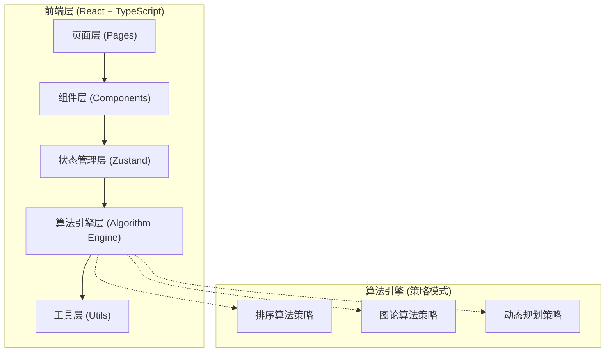

# 算法可视化教学工具 - 技术架构文档

## 1. 架构设计



## 2. 技术选型说明

| 类别 | 技术栈 | 选型理由 |
|------|--------|---------|
| 前端框架 | React 18 + TypeScript | 组件化开发、类型安全、生态丰富 |
| 构建工具 | Vite 5 | 极速热更新、开箱即用的TS支持 |
| 样式方案 | Tailwind CSS 3 | 原子化CSS、快速开发、一致性强 |
| 状态管理 | Zustand | 轻量、简洁、TypeScript友好 |
| 路由 | React Router DOM 6 | 声明式路由、代码分割支持 |
| 图表/可视化 | 原生 SVG + CSS动画 | 轻量、可控性强、无需额外依赖 |
| 代码高亮 | Prism.js | 轻量、多语言支持、自定义主题 |
| 图标 | Lucide React | 现代线性图标、树摇优化 |

## 3. 项目结构

```
Algorithm_View_Web/
├── src/
│   ├── algorithms/           # 算法引擎核心
│   │   ├── types.ts          # 类型定义（统一接口）
│   │   ├── base/             # 基类和工具
│   │   │   ├── Algorithm.ts  # 算法基类（策略模式接口）
│   │   │   └── Step.ts       # 步骤数据结构
│   │   ├── sorting/          # 排序算法
│   │   │   ├── BubbleSort.ts
│   │   │   ├── SelectionSort.ts
│   │   │   ├── InsertionSort.ts
│   │   │   ├── QuickSort.ts
│   │   │   ├── MergeSort.ts
│   │   │   ├── HeapSort.ts
│   │   │   ├── ShellSort.ts
│   │   │   └── CountingSort.ts
│   │   ├── graph/            # 图论算法
│   │   │   ├── BFS.ts
│   │   │   ├── DFS.ts
│   │   │   ├── Dijkstra.ts
│   │   │   ├── Prim.ts
│   │   │   ├── Kruskal.ts
│   │   │   ├── Floyd.ts
│   │   │   └── TopologicalSort.ts
│   │   └── dp/               # 动态规划算法
│   │       ├── Fibonacci.ts
│   │       ├── Knapsack.ts
│   │       ├── LCS.ts
│   │       ├── LIS.ts
│   │       ├── ClimbStairs.ts
│   │       └── CoinChange.ts
│   ├── components/           # 通用组件
│   │   ├── Navbar.tsx
│   │   ├── ControlPanel/
│   │   │   ├── ControlPanel.tsx
│   │   │   ├── PlayButton.tsx
│   │   │   ├── SpeedSlider.tsx
│   │   │   └── SizeSelector.tsx
│   │   ├── CodeViewer.tsx
│   │   ├── ComplexityInfo.tsx
│   │   └── AlgorithmCard.tsx
│   ├── pages/                # 页面组件
│   │   ├── Home.tsx
│   │   ├── Sorting.tsx
│   │   ├── Graph.tsx
│   │   ├── DynamicProgramming.tsx
│   │   └── Compare.tsx
│   ├── visualizations/       # 可视化渲染组件
│   │   ├── sorting/
│   │   │   └── ArrayBars.tsx
│   │   ├── graph/
│   │   │   └── GraphCanvas.tsx
│   │   └── dp/
│   │       └── DPTable.tsx
│   ├── store/                # 状态管理
│   │   └── useAlgorithmStore.ts
│   ├── hooks/                # 自定义hooks
│   │   ├── useAnimation.ts
│   │   └── useAlgorithmRunner.ts
│   ├── utils/                # 工具函数
│   │   ├── arrayUtils.ts
│   │   ├── graphUtils.ts
│   │   └── colorUtils.ts
│   ├── data/                 # 静态数据
│   │   └── algorithms.ts
│   ├── App.tsx
│   ├── main.tsx
│   └── index.css
├── public/
├── index.html
├── package.json
├── vite.config.ts
├── tsconfig.json
├── tailwind.config.js
└── postcss.config.js
```

## 4. 核心设计模式

### 4.1 策略模式 - 算法统一接口

```typescript
// 算法步骤类型
interface AlgorithmStep {
  type: string;           // 步骤类型：compare/swap/sorted/visit/etc.
  indices: number[];      // 涉及的索引/节点
  description: string;    // 步骤描述
  data: any;              // 附加数据
}

// 算法结果
interface AlgorithmResult {
  steps: AlgorithmStep[];
  finalState: any;
}

// 算法基类接口
interface IAlgorithm {
  name: string;
  category: 'sorting' | 'graph' | 'dp';
  timeComplexity: { best: string; average: string; worst: string };
  spaceComplexity: string;
  description: string;
  code: string;
  execute(input: any): AlgorithmResult;
}
```

### 4.2 状态管理设计

```typescript
// 算法运行状态
interface AlgorithmState {
  status: 'idle' | 'running' | 'paused' | 'finished';
  currentStep: number;
  totalSteps: number;
  speed: number;           // 1-10
  algorithm: IAlgorithm | null;
  inputData: any;
  steps: AlgorithmStep[];
  currentData: any;
  statistics: { comparisons: number; swaps: number };
}
```

## 5. 路由定义

| 路由路径 | 页面组件 | 功能说明 |
|---------|---------|---------|
| `/` | Home | 首页，算法分类导航 |
| `/sorting` | Sorting | 排序算法可视化 |
| `/graph` | Graph | 图论算法可视化 |
| `/dp` | DynamicProgramming | 动态规划可视化 |
| `/compare` | Compare | 算法对比页面 |

## 6. 关键技术点

### 6.1 动画控制机制
- 预先生成所有算法步骤（generator 函数或一次性生成数组）
- 使用 requestAnimationFrame + 速度因子控制播放
- 支持单步前进/后退、随机跳转
- 状态快照实现倒放功能

### 6.2 可视化渲染
- 排序：CSS transform + transition 实现柱状图动画
- 图论：SVG 渲染节点和边，d3-force 可选布局
- DP：HTML Table + CSS 动画高亮单元格

### 6.3 性能优化
- 算法步骤预计算，运行时仅做渲染
- React.memo 优化可视化组件重渲染
- 使用 requestAnimationFrame 批量更新
- 大数据量时采用虚拟化

### 6.4 可扩展性
- 新增算法只需实现 IAlgorithm 接口并注册
- 可视化组件按类别解耦
- 主题系统支持深浅色切换
